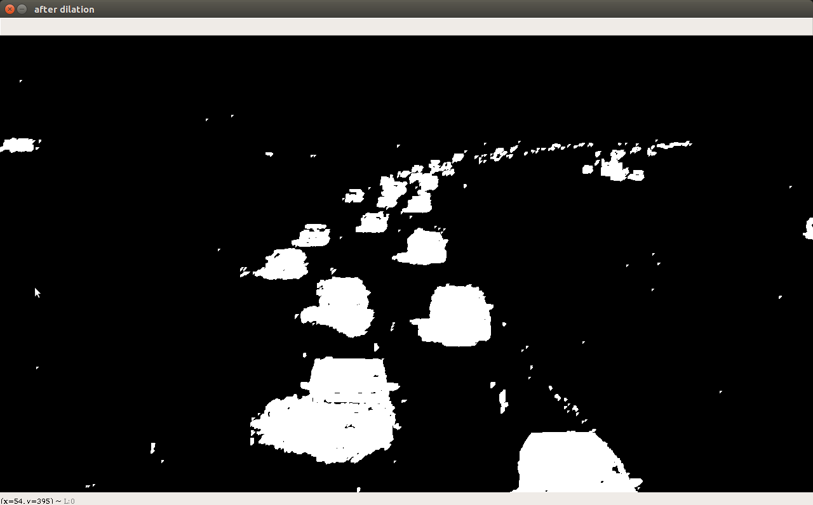
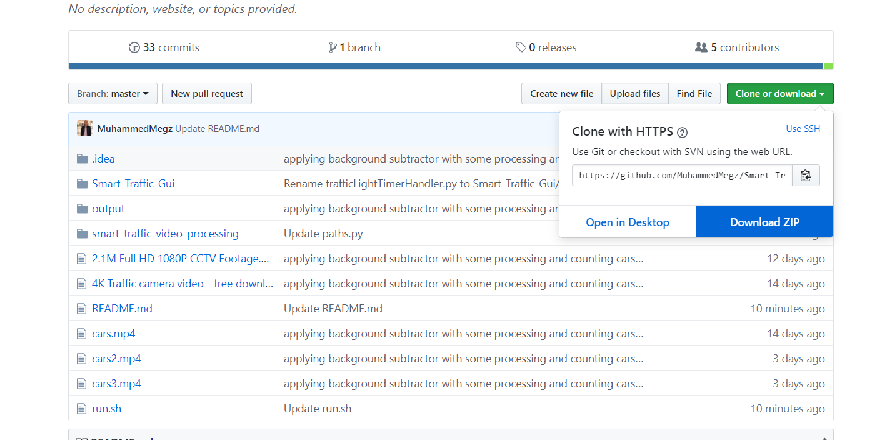
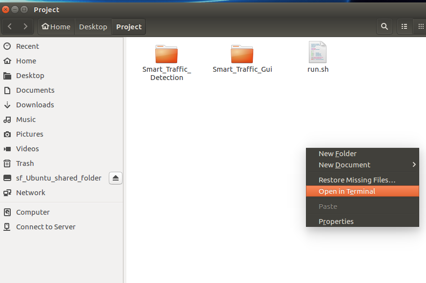
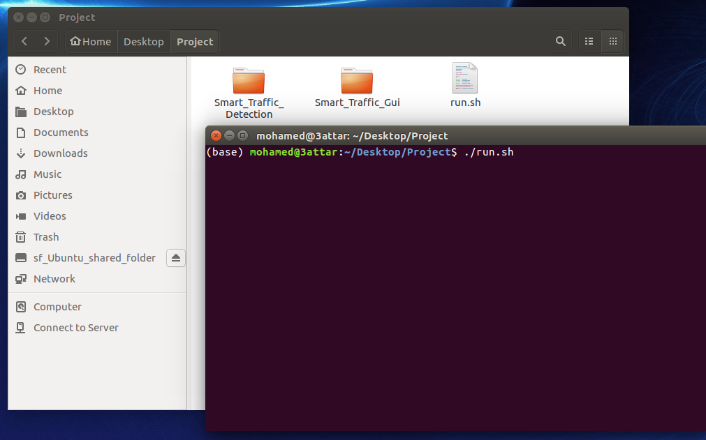
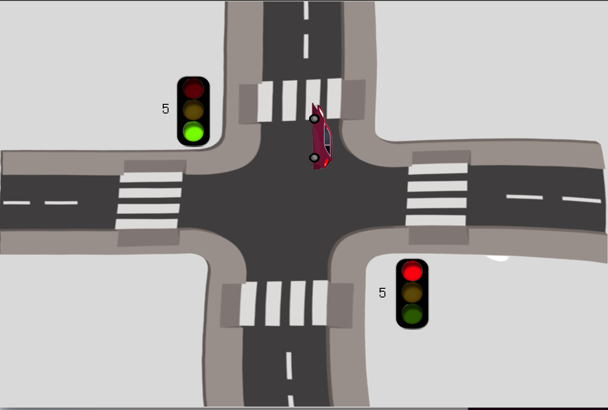
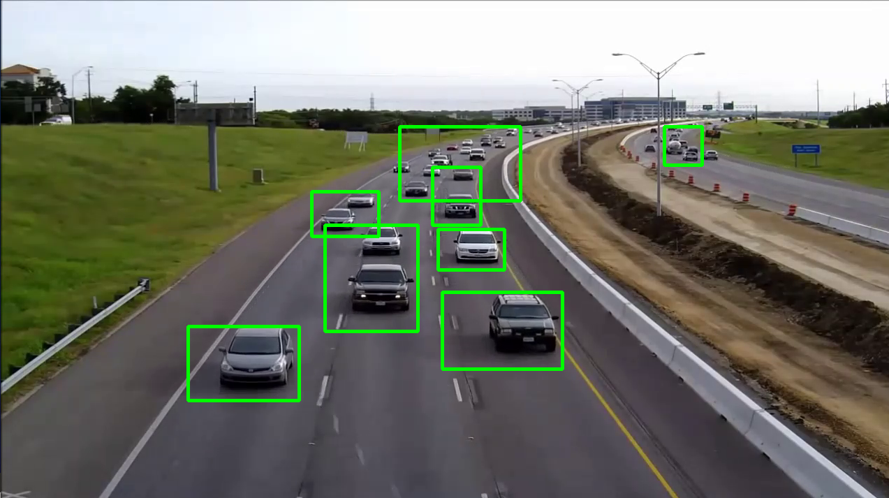
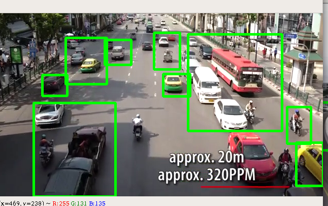
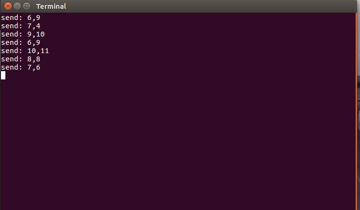
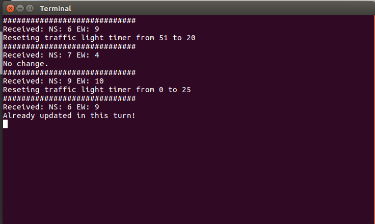

# Smart-Traffic-light-control 

##  Introduction 

This project was made to manage traffic time dynamicly between two directions in main square by splitting time fairly between the two directions depending on the direction with high flow of cars and vehicles.

The side with the high flow have larger time to grant it's vehicles to pass untill the case change or finished it's time.

We adopted to work purely image processing and not using any kind of AI or Machine Learning stuff and make it so simple,
We used openCV functions and features not adding any third party stuff.

## Table of contents:

* [Car Detection](#Car-Detection)
* [Time Divison](#Time-division)
* [GUI](#GUI)
* [How to use (Ubuntu/Linux)](#How-to-use-(Ubuntu/Linux))
## Car Detection:
  
  We used Background subtraction tools to detect the background and trained out application for the first 500 frame, to detect the best and the most reliable background.
  
  This algorithm takes the background pixels and assigns a Gaussian Distribution to each one. The weight of this distribution is the amount of time the colors stay in the scene. Basically, the algorithm tries to identify the background by the information from the Gaussian mixture. The idea is that the longer the color stays the higher the probability that it is a part of the background. The gaussian distribution helps this method to adapt to variance in illumination
  
```
$ EW_bgSubtractor = cv2.createBackgroundSubtractorMOG2(history=500, detectShadows=False)
$ NS_bgSubtractor = cv2.createBackgroundSubtractorMOG2(history=500, detectShadows=False)
```

   createBackgroundSubtractorMOG2 creates a Background object of class BackgroundSubtractorMOG2. When applied to the first image provided to this object, it starts creating a background model. As frames are fed to this object it continues updating the background.
  
   
   
   
   
  Then we make some processing for image quality like openning, closing, dilation, erosion, and blur to draw our contours perfectly, after that thresholding the detected contours to extract the best ones and to be counted as the number of moving vehicles.
  
```
 closing = cv2.morphologyEx(img, cv2.MORPH_CLOSE, kernel, iterations=1)
 opening = cv2.morphologyEx(closing, cv2.MORPH_OPEN, kernel, iterations=1)
 dilation = cv2.dilate(opening, kernel, iterations=2)
 _ , th = cv2.threshold(dilation, 240, 255, cv2.THRESH_BINARY)
```
  # A photo from out model after the bgSubtraction and filtering:
  
  
Finally, Drawing the boxes for detected cars to make sure that the output is correct after this long term processes.
  
```
 EW_contours, _ = cv2.findContours(EW_fgMask, cv2.RETR_LIST, cv2.CHAIN_APPROX_SIMPLE)
 NS_contours, _ = cv2.findContours(NS_fgMask, cv2.RETR_LIST, cv2.CHAIN_APPROX_SIMPLE)
```


 
## Time Divison:

  Time division was the smartest and the main part here to write logic to manage all the scenarios
  
  ```
 def waited_time(q,x):
    if q==0 and x==0:
        return min_waited_time
    ratio=q/(q+x)
    waited_time=ratio*max_waited_time
    if waited_time < min_waited_time :
        waited_time = min_waited_time
    elif waited_time > max_waited_time :
        waited_time = max_waited_time
    return int(waited_time-(waited_time%5))
  ```
  
## GUI: 

  Using Python Tkinter library to build the GUI, first we made a animation to simulate which direction is granted to move, 
  add to this the traffic lights it self animated also.
  
  Then communicating to the time division part and car detection part using socket.io library, it was best choice to not getting any code injection.
  
## How to use (Ubuntu/Linux):
   - Download all files in the repo, the files might exceed 50MB because of the video which the model work on.
      
   - Un-zip
   - Open the un-zipped file then open a new terminal inside this file directory.
   
   - Execute "run.sh" script using this line "./run.sh" in terminal to run the program, you may need to change permissions for this          script using this line "chmod u+x run.sh".
   
   - This script will run 2 new terminals and 3 windows, one for the traffic light simulation, one for the North-South road with the          detected contours and one for the East-West road with detected contours.
   
   
   
   
   
   
   
   The detection module:
   
   
   The GUI program with the actions taken:
   
   
## IPC(Inter process communtication):
    The detection module and the GUI program can't run on the same thread as the GUI needs consistent update an refresh of the screen while the detection module takes time for processing so we ran each program on a different thread with a socket opened to enable communication between the two processes.
    

## Problems:
    We could not find any good videos online from a traffic light camera as those cameras belong to the governement so we used random videos with random cars in it and that resulted in random accuracies for each video.
